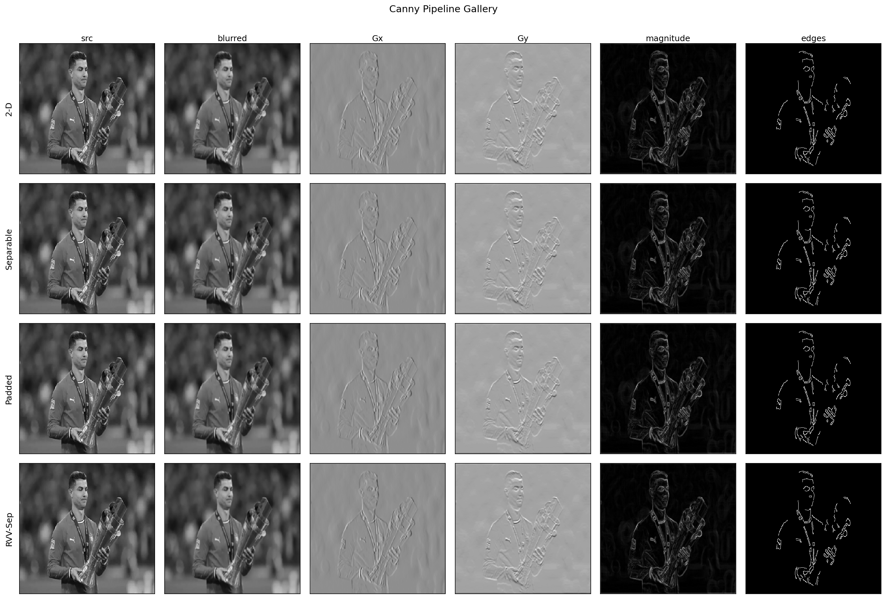
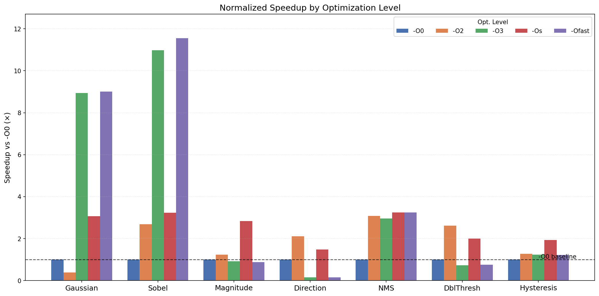

# Canny Edge Detection on RISC-V with RVV Intrinsics


A from-scratch C++17 implementation of the Canny edge detection pipeline targeting the **RISC-V RV64GCV** ISA, with hand-written **RVV 1.0 vector intrinsics** for the two hottest stages. The pipeline runs under QEMU user-mode emulation and is progressively optimized from scalar baseline to vector-length-agnostic intrinsics. The Gaussian stage achieves **6.45×** speedup over scalar `-O0` at VLEN=256 (see [Performance Results](#performance-results)).



---

## Algorithm Overview

Canny Edge Detection is a multi-stage image processing pipeline. Our implementation maps directly to 7 timed stages:

```
Input Image (raw grayscale, 512×512)
      │
      ▼
┌─────────────────────────┐
│  1. Gaussian Blur        │  5×5 kernel, σ≈1.0 — noise suppression
│     3 variants:          │
│     · 2D convolution     │  25 MACs/pixel, boundary-checked
│     · Separable 1D       │  10 MACs/pixel, two-pass
│     · Padded (no-branch) │  25 MACs/pixel, vectorization-friendly
└──────────┬──────────────┘
           ▼
┌─────────────────────────┐
│  2. Sobel Gradients      │  3×3 Kx, Ky → Gx[n], Gy[n]  (int16, SoA)
└──────────┬──────────────┘
           ▼
┌─────────────────────────┐
│  3. Gradient Magnitude   │  L1: |Gx|+|Gy|  or  L2: √(Gx²+Gy²)
│                          │  Normalized to [0, 255]
└──────────┬──────────────┘
           ▼
┌─────────────────────────┐
│  4. Gradient Direction   │  Quantized to {0°, 45°, 90°, 135°}
│                          │  No atan2 — integer cross-multiplication
└──────────┬──────────────┘
           ▼
┌─────────────────────────┐
│  5. Non-Maximum          │  Thin edges to 1-pixel ridges
│     Suppression (NMS)    │
└──────────┬──────────────┘
           ▼
┌─────────────────────────┐
│  6. Double Thresholding  │  STRONG(255) / WEAK(128) / OFF(0)
└──────────┬──────────────┘
           ▼
┌─────────────────────────┐
│  7. Hysteresis           │  BFS from STRONG seeds → promote connected WEAKs
└──────────┬──────────────┘
           ▼
Output Edge Map (binary, {0, 255})
```

---

## Repository Structure

```
canny-edge-riscv/
├── src/                  C++ pipeline sources
│   ├── gaussian.cpp      Scalar Gaussian — three variants (2-D, separable, padded)
│   ├── gaussian_rvv.cpp  RVV Gaussian — LMUL=1/2/4 padded + separable
│   ├── sobel.cpp / sobel_rvv.cpp
│   ├── mag_dir.cpp / mag_dir_rvv.cpp
│   ├── edge_refinement.cpp
│   ├── img_io.cpp
│   └── main.cpp          Entry point — timing, profiling, file I/O
├── include/              Headers for all modules
├── tests/
│   ├── unit/             GoogleTest host-side unit tests
│   └── integ/            QEMU-side RVV equivalence and VLEN sweep tests
├── tools/
│   ├── cpp/              Pipeline helpers, report generation, lmul sweep
│   └── python/           Visualization scripts (plot_*.py, utils.py)
├── scripts/
│   ├── setup.sh          Toolchain + QEMU bootstrap script
│   └── verify.sh         End-to-end verification at all three VLENs
├── docs/                 Generated reports and figures (not committed — see .gitignore)
│   └── plots/            Generated PNG charts
├── imgs/                 Generated pipeline output images (not committed)
├── Makefile
├── AI_USAGE_LOG.md
└── README.md
```

---

## Prerequisites

| Dependency | Version | Notes |
|---|---|---|
| RISC-V GNU Toolchain | GCC 13.x–15.x (verified: 15.2.0) | Built with `--with-arch=rv64gcv`; see `scripts/setup.sh` |
| QEMU | 9.x+ (verified: 11.0.50, dev build) | `riscv64-linux-user` mode only |
| Python | 3.10+ | With `numpy`, `matplotlib` |
| GoogleTest | any recent | Host-only, for `make test` |

Run `bash scripts/setup.sh` for fully automated installation (30–90 min first time, re-runnable).

---

## Quick Start

```bash
# 1. Bootstrap toolchain and QEMU (30-90 min first time)
bash scripts/setup.sh

# 2. Verify the environment and toolchain
bash scripts/verify.sh

# 3. Run host-side unit tests
make test

# 4. Cross-compile and run on QEMU (512×512 image, all timings)
make run_target W=512 H=512 I=0

# 5. Generate all visualizations
make plots W=512 H=512 I=0
# figures written to docs/plots/*.png

# 6. Verify RVV correctness at all VLENs
make test_rvv_equiv
```

---

## Build Targets Reference

| Target | Description |
|---|---|
| `make test` | Compile and run all GoogleTest unit tests on the host (g++) |
| `make run_host W=… H=… I=…` | Run full pipeline on host, save output `.raw` images to `imgs/` |
| `make run_target W=… H=… I=…` | Cross-compile and run on QEMU; print timing tables |
| `make run_all W=… H=… I=…` | Run QEMU at VLEN=128, 256, and 512 sequentially |
| `make sweep` | Compile at all opt levels and collect `docs/bench_results.txt` |
| `make sweep_all_methods` | Run all three Gaussian sweeps (2d, sep, padded) |
| `make autovec` | Compile with `-fopt-info-vec-all`; collect `docs/autovec_report.txt` |
| `make test_rvv_equiv` | Run RVV equivalence tests at VLEN=128, 256, 512 on QEMU |
| `make test_vlen_sweep` | Run correctness sweep across VLEN=128, 256, 512 on QEMU |
| `make vlen_sweep` | Stage timing breakdown at each VLEN → `docs/vlen_sweep.txt` |
| `make lmul_sweep` | Gaussian LMUL=1/2/4 timing at each VLEN → `docs/lmul_gaussian.txt` |
| `make plots W=… H=… I=…` | Generate all `docs/plots/*.png` figures |
| `make reports` | Full regeneration of all docs and plots in one shot |
| `make canny_rv` | Cross-compile RISC-V binary only (no run) |
| `make verify_rvv` | Phase 1 toolchain smoke test at VLEN=128/256/512 |
| `make clean` | Remove all build artifacts |

Runtime variables: `W` (width, default 256), `H` (height, default 256), `I` (image index 0–6, default 0), `VLEN` (128/256/512, default 256).

**Image index `I`:** `0`=white\_square `1`=circle `2`=vertical\_edge `3`=horizontal\_edge `4`=checkerboard `5`=impulse `6`=gradient\_ramp

---

## Performance Results

**Gaussian stage speedup (512×512 image, 100 iterations)**

| Method | VLEN | Time (µs) | Speedup vs scalar -O0 |
|---|---|---|---|
| Scalar 2-D `-O0` | — | 201,811 | 1.00× |
| Scalar 2-D `-O3` | — | 259,764 | 0.78× (regresses — see note) |
| Scalar Separable `-O3` | — | 101,611 | 1.99× |
| Scalar Padded `-O3` (auto-vec) | — | 11,647 | 17.33× |
| RVV Padded m2 | 128 | 62,216 | 3.24× |
| RVV Padded m2 | 256 | 45,423 | 4.44× |
| RVV Padded m2 | 512 | 40,240 | 5.02× |
| RVV Separable | 128 | 43,169 | 4.67× |
| RVV Separable | 256 | 31,306 | **6.45×** |
| RVV Separable | 512 | 34,069 | 5.92× |

> `-O3` regresses vs `-O0` for the 2-D kernel specifically: its nested kernel-row/kernel-col loop structure cannot be auto-vectorized at any optimization level (see Auto-vectorization Analysis in the optimization report), so `-O3`'s extra unrolling/scheduling adds overhead under QEMU's instruction-count cost model with no vectorization payoff to offset it — the same mechanism documented there for Magnitude/Direction.
>
> Numbers sourced from `docs/bench_results_2d.txt`, `docs/bench_results_sep.txt`, `docs/bench_results_padded.txt`, `docs/timing_vlen{128,256,512}.txt`, and the RVV-Separable `[Step 6]` pipeline output — run `make reports` to regenerate.



---

## Team

| Name | GitHub | Role |
|---|---|---|
| Kareem Ashraf | @kareem05-ash | Phase 1 (toolchain, CI), Phase 4–5 (main.cpp, Makefile, Python tools) |
| Fahd Mohamed | — | Phase 2–3 (Gaussian), Phase 6 (RVV Gaussian), testing |
| Kareem Zakaria | — | Phase 2–3 (Sobel), Phase 4 (sweep tools), Phase 6 (RVV Sobel) |
| Mohamed Ali | — | Phase 2–3 (Magnitude & Direction), Phase 5 (reports), docs |
| Zyad Sakr | — | Phase 2–3 (Edge Refinement) |

---

## References

- [RVV 1.0 Intrinsic Specification](https://github.com/riscv-non-isa/riscv-rvv-intrinsic-doc)
- [RISC-V V Extension Specification](https://github.com/riscv/riscv-v-spec)
- [QEMU RISC-V Documentation](https://qemu.org/docs/master/system/target-riscv.html)
- [RISC-V GNU Toolchain](https://github.com/riscv-collab/riscv-gnu-toolchain)
- [GoogleTest](https://google.github.io/googletest)
- Project specification: `RV-Embedded-Project.pdf`
- Hints and directions: `RV-Embedded-detailed_hints_guide.pdf`
