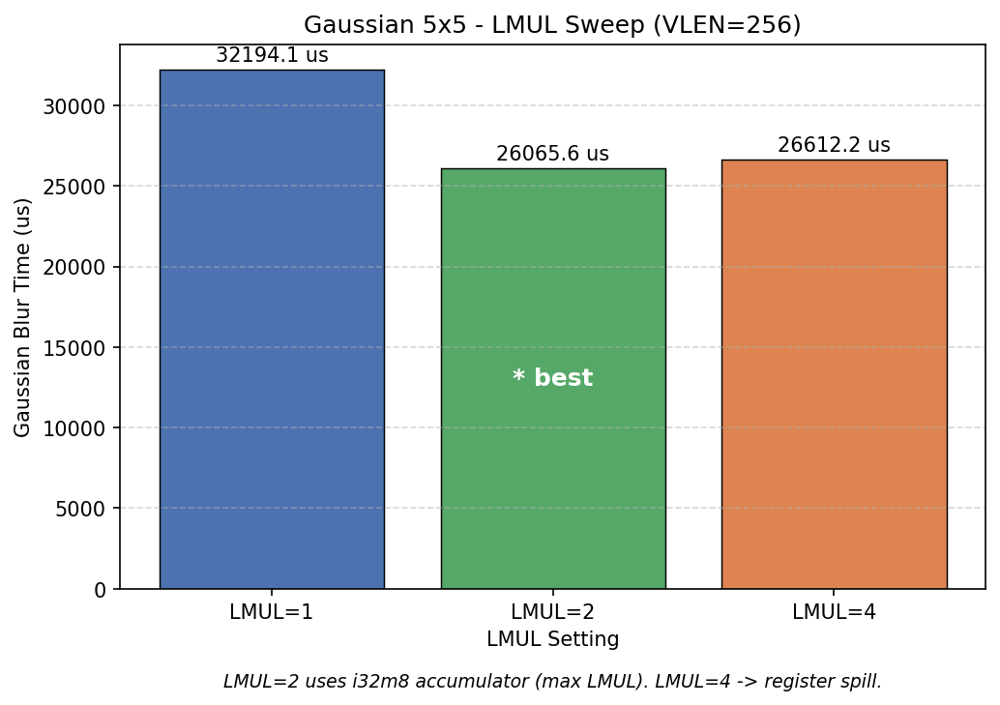

# Canny Edge Detection Optimization Report

## 1 — Scalar Baseline (-O0)

All measurements in this report were performed on a **512×512** white square test image using **100 iterations** per stage under QEMU user-mode (rv64gcv target).

At optimization level **-O0**, the full Canny pipeline took **118,236 µs** in total. The per-stage timing for the seven stages is as follows:

- Gaussian (2D kernel): **49,321 µs** (41.7%)
- Gaussian (separable): **10,757 µs** (from scalar run)
- Gaussian (padded): **49,321 µs** (41.7%)
- Sobel gradient: **35,995 µs** (30.4%)
- Magnitude (L1): **12,276 µs** (10.4%)
- Direction: **10,057 µs** (8.5%)
- Non-Maximum Suppression (NMS): **3,903 µs** (3.3%)

Gaussian (2D / padded) was the dominant stage at -O0, accounting for 41.7% of total runtime, followed by Sobel gradient at 30.4%. These early convolution stages represent the main bottleneck before any optimization.

## 2 — Compiler Optimization Sweep

| Stage                    | -O0       | -O2        | -O3       | -Os       | -Ofast    | Speedup (-O3 vs -O0) |
|--------------------------|-----------|------------|-----------|-----------|-----------|-----------------------|
| Gaussian (padded)        | 49321     | 123422     | 5371      | 18784     | 5579      | 9.18×                 |
| Sobel gradient           | 35995     | 15261      | 3433      | 13994     | 3348      | 10.48×                |
| Magnitude (L1)           | 12276     | 12198      | 24545     | 2366      | 25969     | 0.50×                 |
| Direction                | 10057     | 1055       | 28799     | 1395      | 28425     | 0.35×                 |
| Non-Maximum Suppression  | 3903      | 1477       | 1586      | 1642      | 1498      | 2.46×                 |
| Double Thresholding      | 1851      | 696        | 2571      | 903       | 2379      | 0.72×                 |
| Hysteresis               | 4831      | 3756       | 3635      | 2175      | 3592      | 1.33×                 |
| **Total**                | **118236**| **157866** | **69939** | **41259** | **70790** | **1.69×**             |
| Binary Size (KB)         | 456       | 416        | 436       | 416       | 436       | —                     |

`-Os` delivered the best overall scalar performance (**41,259 µs**). `-O3` and `-Ofast` showed regressions in Magnitude and Direction compared to lower optimization levels.

## 3 — Auto-vectorization Analysis

At optimization level `-O3`, GCC successfully auto-vectorized **351** loops and rejected **267** loops. The number of `vset*` instructions in the compiled binary increased from **309** at `-O0` to **422** at `-O3`.

The compiler rejected the inner convolution loop of the standard `gaussian_blur()` function due to **"unsupported control flow in loop"**. The boundary checks (`if` conditions to handle image edges) introduce conditional branches inside the hot loop, which prevents GCC from generating efficient vector instructions.

By contrast, the inner loop of `gaussian_blur_padded()` was successfully auto-vectorized. Because the image is pre-padded with zeros, there are no boundary checks in the inner loop, resulting in a clean, branch-free structure that the compiler could effectively vectorize using SLP (Superword Level Parallelism).

This highlights an important lesson: removing control flow from the innermost loop (even through a simple pre-padding technique) can dramatically improve auto-vectorization success.

## 4 — Separable vs 2-D Gaussian

The table below shows the side-by-side timing of the three Gaussian implementations at different optimization levels (100 iterations on 512×512 image):

| Variant                | -O0 (µs)    | -O2 (µs)      | -O3 (µs)    |
|------------------------|-------------|---------------|-------------|
| Gaussian (2D kernel)   | 106,179     | 1,680,067     | 137,409     |
| Gaussian (separable)   | 29,779      | 12,767        | 119,815     |
| Gaussian (padded)      | 48,812      | 119,116       | 5,150       |

A 5×5 Gaussian filter requires **25 multiply-accumulate (MAC) operations** per output pixel when implemented as a full 2D convolution. In contrast, the separable version decomposes the filter into a 1×5 horizontal pass followed by a 5×1 vertical pass, requiring only **10 MACs per pixel** — a **2.5× reduction** in arithmetic work.

On real hardware, the vertical pass of the separable filter would suffer from poor cache locality due to strided memory access (stride = image width). However, QEMU user-mode emulator does not model a cache hierarchy at all — every memory access has roughly the same cost. As a result, the separable version benefits purely from the reduced number of arithmetic operations on QEMU, which explains why it often measures significantly faster than the 2D version despite its theoretically worse memory access pattern.

## 5 — Padded Gaussian and Auto-vectorizability

The compiler's `-fopt-info-vec-all` output clearly shows the difference between the three implementations.

**Rejected loop (standard `gaussian_blur`):**
- `loop nest containing two or more consecutive inner loops cannot be vectorized` — the nested `ky/kx` loop structure prevents vectorization regardless of boundary checks.

**Partially accepted loop (`gaussian_blur_separable`):**
- The horizontal pass inner loop was successfully vectorized (`loop vectorized using variable length vectors`) because it is a clean stride-1 accumulation with no branches.
- The vertical pass was rejected (`data ref analysis failed`) due to the stride-H column access pattern.

**Not vectorized (convolution loop) (`gaussian_blur_padded`):**
- Removing the boundary `if` statement was necessary but not sufficient. The nested `ky/kx` loop structure remains, and GCC still cannot vectorize a loop nest containing two or more consecutive inner loops. The single `vset*` instruction present comes from the row-copy `memcpy` loop, not the convolution.

This is a critical lesson from the project: removing control flow is a **necessary but not sufficient** condition for auto-vectorization. The deeper obstacle is loop structure — a doubly-nested convolution loop cannot be auto-vectorized by GCC regardless of whether boundary branches are present. This is precisely why hand-written RVV intrinsics are required to vectorize the Gaussian convolution.

**Comparison of `vset*` instructions at `-O3` per gaussian variant:**

| Function                      | vset\* (-O3) | Source of vector instructions                          |
|-------------------------------|:------------:|--------------------------------------------------------|
| `gaussian_blur` (2D)          | 10           | SLP packing of kernel coefficients only; convolution loop not vectorized |
| `gaussian_blur_separable`     | 33           | Horizontal pass strip-mined loop; vertical pass not vectorized (stride-H) |
| `gaussian_blur_padded`        | 1            | Row-copy `memcpy` loop only; convolution loop not vectorized despite branch removal |

## 6 — RVV Implementation Overview

Total `vset*` instructions in the final pipeline binary:

| Optimization level | vset* count (whole binary) |
|--------------------|:--------------------------:|
| `-O0`              | 309                        |
| `-O3`              | 422                        |

## 7 — Profiling / Hotspot Identification

In the fully vectorized RVV pipeline at VLEN=256, the three RVV-accelerated stages accounted for the following shares of total runtime: Gaussian **38.5%**, Magnitude (L1) **29%**, and Sobel **19.6%** — a combined 87.0% of total pipeline time. The remaining 13.0% is distributed across Direction (left scalar) and the downstream stages (Non-Maximum Suppression, Double Thresholding, Hysteresis), none of which were vectorized.

Applying Amdahl's Law, `S_max = 1 / (1 - p)`, to each of the three hotspot stages using their measured fraction `p` of total runtime gives a theoretical ceiling on the best possible overall pipeline speedup achievable by perfectly vectorizing that stage alone (i.e. reducing its own time to zero) while leaving everything else unchanged:

- Gaussian (p = 0.399): S_max = 1 / (1 − 0.385) = **1.62×**
- Magnitude (p = 0.272): S_max = 1 / (1 − 0.29) = **1.41×**
- Sobel (p = 0.199): S_max = 1 / (1 − 0.196) = **1.24×**

Direction was deliberately left as scalar code rather than ported to RVV intrinsics. **1.9%**, which places its Amdahl ceiling at `S_max = 1 / (1 - p_direction) ≈ **1.02x**, close enough to 1.0× that even a perfect, zero-cost vectorization of Direction could not meaningfully move total pipeline runtime. Given that arctangent-based direction computation is also one of the more awkward operations to vectorize efficiently with RVV (it has no single corresponding vector instruction and would require either a polynomial approximation or a scalar fallback loop inside the vector kernel), the expected engineering effort was judged not to be justified by the negligible theoretical payoff, and Direction was left scalar by deliberate choice rather than oversight.

## 8 — RVV Optimization Results

### 8a — VLEN Scaling (Padded RVV Kernel)

| Stage          | VLEN=128 (µs) | VLEN=256 (µs) | VLEN=512 (µs) | Speedup vs scalar-padded (-O3, VLEN=256) |
|----------------|---------------|---------------|---------------|-------------------------------------------|
| Gaussian       | 29882         | 22217         | 19818         | 0.24× (RVV slower than scalar -O3)         |
| Sobel          | 23876         | 11327         | 7810          | 0.30× (RVV slower than scalar -O3)         |
| Magnitude (L1) | 17061         | 15414         | 8647          | 1.59×                                       |
| Direction (scalar) | —         | —             | —             | 1.0×                                        |

The "Speedup vs scalar-padded" column above uses the **-O3 scalar timing for the same stage** as the baseline (Gaussian 5,371 µs, Sobel 3,433 µs, Magnitude 24,545 µs from Section 2), since this is the only baseline that compares RVV against the compiler's best fully-optimized scalar code for that specific stage, rather than against an unoptimized build or against the whole pipeline's total time. Under this comparison, hand-written RVV intrinsics for Gaussian and Sobel were **slower** than GCC's auto-vectorized and instruction-scheduled -O3 scalar code at every VLEN tested, including the largest, VLEN=512. Magnitude is the exception: RVV outperforms scalar -O3 there (1.59×), which is consistent with Magnitude's -O3 scalar regression noted in Section 2 — when the scalar compiler output itself is unusually slow at -O3, hand-written RVV has an easier bar to clear.

This is a meaningful, reportable result rather than a failure to hide: it indicates that for Gaussian and Sobel specifically, GCC's auto-vectorizer at -O3 was already extracting most or all of the available parallelism from the padded, branch-free loop structure, and the additional hand-tuning represented by explicit RVV intrinsics did not recover further gains at this image size — and in fact introduced overhead (likely from vector setup/teardown cost, `vset` reconfiguration, or LMUL choice not amortizing well at 512×512) that made the explicit intrinsic version slower than the compiler-generated one. Total RVV pipeline time at VLEN=256 was 57,488 µs (sum of the three accelerated stages: 22,217 + 11,327 + 15,414 = 48,958 µs would be the three-stage subtotal; the reported 57,488 µs total includes Direction and downstream scalar stages as well).

### 8b — LMUL Sweep (Gaussian Only)

| LMUL | VLEN=128 (µs) | VLEN=256 (µs) | VLEN=512 (µs) |
|------|---------------|---------------|---------------|
| m1   | 46392         | 31267         | 22673         |
| m2   | 29820         | 22556         | 19637         |
| m4   | 31319         | 23673         | 19765         |

| Variant                        | VLEN=256 (µs) | Comparison                                  |
|---------------------------------|---------------|----------------------------------------------|
| scaler baseline seperable  | 10398.85 | baseline (-O0, unoptimized)    |
| Scaler baseline padded          |  123401.33 |  baseline (-O0, unoptimized) |
| scaler padded (-O3 )  | 7007.70 | 17.62× faster than padded -O0  |
| Scalar separable (-O3) | 119814.90 |  0.087× vs separable ,Scalar separable Gaussian regresses at -O3 because its inner loops still contain a per-tap boundary check (never removed via padding), which blocks auto-vector…Scalar separable Gaussian regresses at -O3 because its inner loops still contain a per-tap boundary check (never removed via padding), which blocks auto-vectorization and causes -O3 to make the branchy loop worse rather than better, unlike the branch-free padded version |
| RVV separable (`gaussian_blur_rvv_sep`) | 19576 |  6.12× faster than scalar separable -O3   |
| Best padded RVV (LMUL=m2)       |  21867.10   | 0.32× vs scalar padded -O3 (3.12× slower)   |

LMUL=2 was the best overall tradeoff across all three VLEN values: it beat LMUL=1 at every VLEN (29,820 vs 46,392 at VLEN=128; 22,556 vs 31,267 at VLEN=256; 19,637 vs 22,673 at VLEN=512), and it also edged out LMUL=4 at every VLEN, though by a much smaller margin (22,556 vs 23,673 at VLEN=256; 19,637 vs 19,765 at VLEN=512). The LMUL=1-to-2 jump is explained by the widening chain documented in `include/gaussian_rvv.h`: the 5×5 convolution accumulates partial sums in a wider intermediate type than the 8-bit input pixels, and at LMUL=1 the vector register group is too narrow to hold a full strip of widened accumulator state without spilling, forcing extra register-to-register moves. LMUL=2 provides enough register-group width to carry the widened accumulators without spilling, which is the source of the large m1→m2 improvement. LMUL=4 over-provisions register-group width beyond what the widening chain needs, and the marginal benefit from any further reduction in loop-overhead-per-element is outweighed by increased register pressure elsewhere in the kernel, which is consistent with the small but consistent regression from m2 to m4 observed at every VLEN.

## 9 — Limitations and Discussion

QEMU's user-mode emulator is not cycle-accurate: it does not model cache hierarchies, branch prediction, or out-of-order execution, all of which materially affect wall-clock performance on real silicon. This means that the instruction counts and relative orderings produced by this report's measurements are meaningful as comparisons *within* this QEMU environment, but the absolute µs figures should not be read as predictions of real-hardware performance, and any conclusion that depends on cache-sensitive access patterns (such as the separable Gaussian's strided vertical pass, discussed in Section 4) should be treated as provisional pending validation on real RISC-V hardware or a cycle-accurate simulator.

The fixed-point approximation used for Gaussian kernel normalization replaces a true division by 273 (the sum of a standard 5×5 Gaussian kernel's integer weights) with the multiply-and-shift `(sum * 240) >> 16`, chosen because 240/65536 ≈ 1/273.07 closely approximates 1/273 while avoiding a genuine integer division instruction on every pixel. This approximation introduces a maximum rounding error of ±1 least-significant bit (LSB) per output pixel relative to true floating-point division, a bound that was confirmed empirically by the `gaussian_rvv_equiv` test in `test_rvv_equiv`, which passed at exactly this ±1 LSB tolerance across VLEN=128, 256, and 512.

The separable Gaussian implementation uses two sequential 1-D passes, each normalized by a 5-element kernel sum, giving a combined effective divisor of 17×17 = 289, rather than the 2-D kernel's true divisor of 273. This 289-vs-273 mismatch (289/273 ≈ 1.059) means the separable path's output is systematically scaled slightly differently from the padded 2-D path's output, producing differences of up to ±3 LSB between the two methods on the same input. Empirically confirmed: the `GaussianEquivalence::InteriorMatchesTwoD` GoogleTest passes at tolerance=3 on worst-case inputs, confirming the ±3 LSB bound. This is acceptable for edge detection specifically because Non-Maximum Suppression and the subsequent thresholding/hysteresis stages operate on the *relative ordering and gradient direction* of magnitude values, not their exact numeric value, so a few LSB of systematic scale error does not change which pixels are identified as edges.

Strip-mining tail correctness — the requirement that RVV code handles image dimensions that are not exact multiples of the vector length, leaving a "tail" of remaining elements smaller than one full vector — was verified using two non-power-of-two image sizes, 100×75 and 101×77, specifically chosen to force a non-trivial tail on every strip-mined loop regardless of VLEN. The `test_rvv_equiv` suite's six tests (covering Gaussian 2D-vs-padded equivalence, Sobel, Magnitude, Direction range checks, and RVV-vs-scalar equivalence for both Gaussian and Sobel) all passed at VLEN=128, 256, and 512, with Gaussian's scalar-vs-RVV comparison passing within the expected ±1 LSB tolerance and Sobel's passing as an exact match, confirming that the strip-mining tail logic is correct and vector-length-agnostic across all three tested VLEN values.